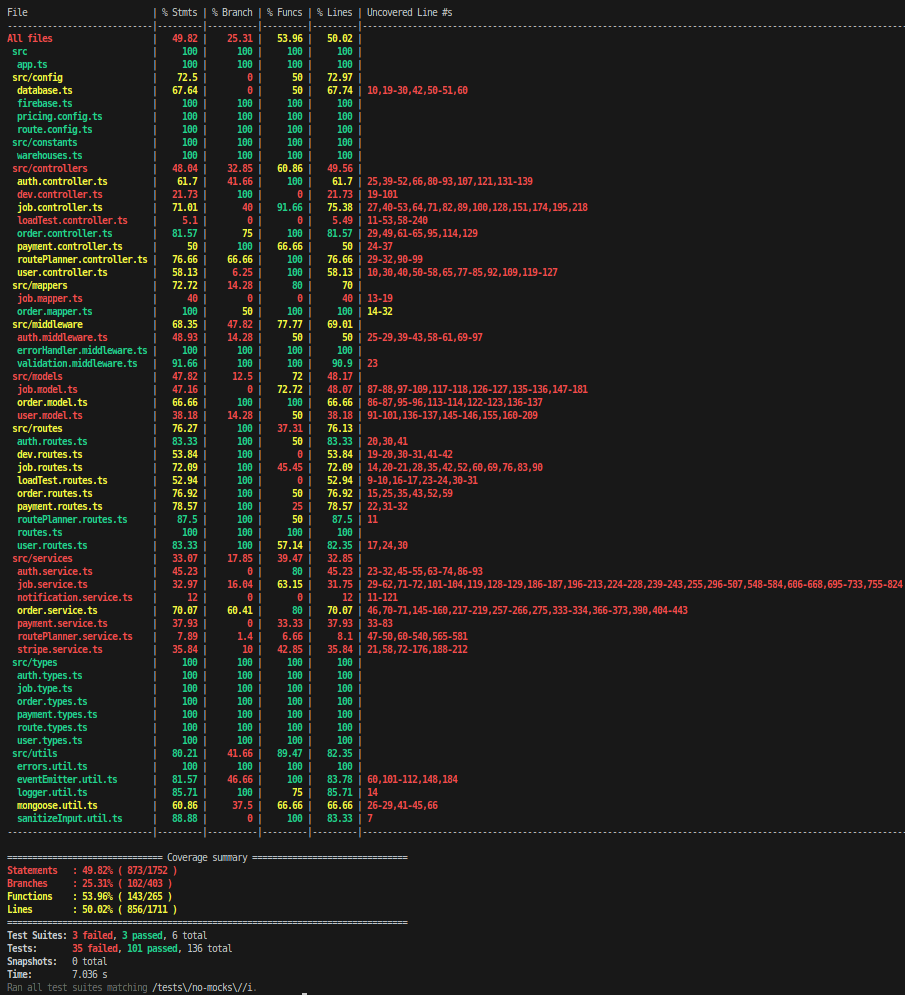
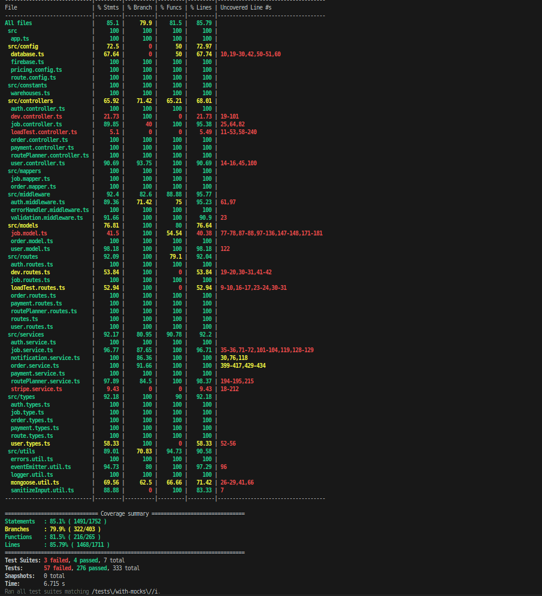
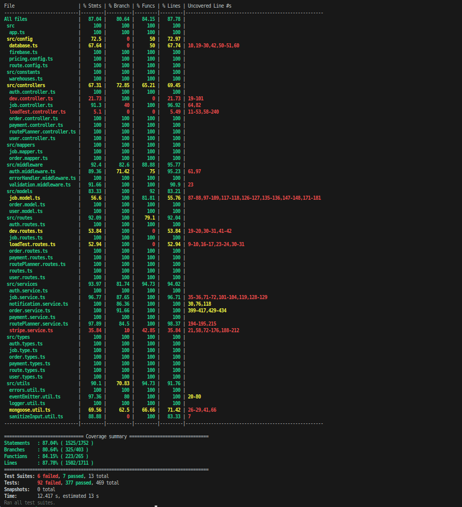

# Testing and Code Review

## 1. Change History

| **Change Date** | **Modified Sections** | **Rationale** |
|-----------------| --------------------- | ------------- |
| _Nov 12_        |         All          | Initial document creation. |

---

## 2. Back-end Test Specification: APIs

### 2.1. Locations of Back-end Tests and Instructions to Run Them

#### 2.1.1. Tests

| **Interface**                 | **Describe Group Location, No Mocks**                | **Describe Group Location, With Mocks**            | **Mocked Components**              |
| ----------------------------- | ---------------------------------------------------- | -------------------------------------------------- | ---------------------------------- |
| **POST /api/auth/signup**        | [`backend/tests/no-mocks/auth.routes.test.ts#L76`](https://github.com/YahyaMajd/CPEN321-Project/blob/main/backend/tests/no-mocks/auth.routes.test.ts#L76)| [`backend/tests/with-mocks/auth.routes.test.ts#L98`](https://github.com/YahyaMajd/CPEN321-Project/blob/main/backend/tests/with-mocks/auth.routes.test.ts#L98) | None (uses real OAuth2Client and DB) |
| **POST /api/auth/signin** | [`backend/tests/no-mocks/auth.routes.test.ts#L115`](https://github.com/YahyaMajd/CPEN321-Project/blob/main/backend/tests/no-mocks/auth.routes.test.ts#L115) | [`backend/tests/with-mocks/auth.routes.test.ts#L576`](https://github.com/YahyaMajd/CPEN321-Project/blob/main/backend/tests/with-mocks/auth.routes.test.ts#L576) | None (uses real OAuth2Client and DB) |
| **POST /api/auth/select-role** | [`backend/tests/no-mocks/auth.routes.test.ts#L154`](https://github.com/YahyaMajd/CPEN321-Project/blob/main/backend/tests/no-mocks/auth.routes.test.ts#L154)| [`backend/tests/with-mocks/auth.routes.test.ts#L821`](https://github.com/YahyaMajd/CPEN321-Project/blob/main/backend/tests/with-mocks/auth.routes.test.ts#L821) | None (uses real DB) |
| **POST /api/jobs** | [`backend/tests/no-mocks/jobs.routes.test.ts#L92`](https://github.com/YahyaMajd/CPEN321-Project/blob/main/backend/tests/no-mocks/jobs.routes.test.ts#L92) | [`backend/tests/with-mocks/jobs.routes.test.ts#L156`](https://github.com/YahyaMajd/CPEN321-Project/blob/main/backend/tests/with-mocks/jobs.routes.test.ts#L156) | Database Connection, Auth Middleware, Validation Middleware, Job Model, Order Service, Notification Service, Event Emitter, User Model |
| **GET /api/jobs** | [`backend/tests/no-mocks/jobs.routes.test.ts#L329`](https://github.com/YahyaMajd/CPEN321-Project/blob/main/backend/tests/no-mocks/jobs.routes.test.ts#L329) | [`backend/tests/with-mocks/jobs.routes.test.ts#L285`](https://github.com/YahyaMajd/CPEN321-Project/blob/main/backend/tests/with-mocks/jobs.routes.test.ts#L285) | Database Connection, Auth Middleware, Job Model |
| **GET /api/jobs/available** | [`backend/tests/no-mocks/jobs.routes.test.ts#L390`](https://github.com/YahyaMajd/CPEN321-Project/blob/main/backend/tests/no-mocks/jobs.routes.test.ts#L390) | [`backend/tests/with-mocks/jobs.routes.test.ts#L309`](https://github.com/YahyaMajd/CPEN321-Project/blob/main/backend/tests/with-mocks/jobs.routes.test.ts#L309) | Database Connection, Auth Middleware, Job Model |
| **GET /api/jobs/mover** | [`backend/tests/no-mocks/jobs.routes.test.ts#L439`](https://github.com/YahyaMajd/CPEN321-Project/blob/main/backend/tests/no-mocks/jobs.routes.test.ts#L439) | [`backend/tests/with-mocks/jobs.routes.test.ts#L333`](https://github.com/YahyaMajd/CPEN321-Project/blob/main/backend/tests/with-mocks/jobs.routes.test.ts#L333) | Database Connection, Auth Middleware, Job Model |
| **GET /api/jobs/student** | [`backend/tests/no-mocks/jobs.routes.test.ts#L513`](https://github.com/YahyaMajd/CPEN321-Project/blob/main/backend/tests/no-mocks/jobs.routes.test.ts#L513) | [`backend/tests/with-mocks/jobs.routes.test.ts#L378`](https://github.com/YahyaMajd/CPEN321-Project/blob/main/backend/tests/with-mocks/jobs.routes.test.ts#L378) | Database Connection, Auth Middleware, Job Model |
| **GET /api/jobs/:id** | [`backend/tests/no-mocks/jobs.routes.test.ts#L585`](https://github.com/YahyaMajd/CPEN321-Project/blob/main/backend/tests/no-mocks/jobs.routes.test.ts#L585) | [`backend/tests/with-mocks/jobs.routes.test.ts#L423`](https://github.com/YahyaMajd/CPEN321-Project/blob/main/backend/tests/with-mocks/jobs.routes.test.ts#L423) | Database Connection, Auth Middleware, Job Model |
| **PATCH /api/jobs/:id/status** | [`backend/tests/no-mocks/jobs.routes.test.ts#L640`](https://github.com/YahyaMajd/CPEN321-Project/blob/main/backend/tests/no-mocks/jobs.routes.test.ts#L640) | [`backend/tests/with-mocks/jobs.routes.test.ts#L602`](https://github.com/YahyaMajd/CPEN321-Project/blob/main/backend/tests/with-mocks/jobs.routes.test.ts#L602) | Database Connection, Auth Middleware, Validation Middleware, Job Model, Order Service, Notification Service, Event Emitter, User Model |
| **POST /api/jobs/:id/arrived** | [`backend/tests/no-mocks/jobs.routes.test.ts#L902`](https://github.com/YahyaMajd/CPEN321-Project/blob/main/backend/tests/no-mocks/jobs.routes.test.ts#L902) | [`backend/tests/with-mocks/jobs.routes.test.ts#L1242`](https://github.com/YahyaMajd/CPEN321-Project/blob/main/backend/tests/with-mocks/jobs.routes.test.ts#L1242) | Database Connection, Auth Middleware, Job Model, Order Service, Notification Service, Event Emitter, User Model |
| **POST /api/jobs/:id/confirm-pickup** | [`backend/tests/no-mocks/jobs.routes.test.ts#L1024`](https://github.com/YahyaMajd/CPEN321-Project/blob/main/backend/tests/no-mocks/jobs.routes.test.ts#L1024) | [`backend/tests/with-mocks/jobs.routes.test.ts#L1305`](https://github.com/YahyaMajd/CPEN321-Project/blob/main/backend/tests/with-mocks/jobs.routes.test.ts#L1305) | Database Connection, Auth Middleware, Job Model, Order Service, Notification Service, Event Emitter, User Model |
| **POST /api/jobs/:id/delivered** | [`backend/tests/no-mocks/jobs.routes.test.ts#L1215`](https://github.com/YahyaMajd/CPEN321-Project/blob/main/backend/tests/no-mocks/jobs.routes.test.ts#L1215) | [`backend/tests/with-mocks/jobs.routes.test.ts#L1367`](https://github.com/YahyaMajd/CPEN321-Project/blob/main/backend/tests/with-mocks/jobs.routes.test.ts#L1367) | Database Connection, Auth Middleware, Job Model, Order Service, Notification Service, Event Emitter, User Model |
| **POST /api/jobs/:id/confirm-delivery** | [`backend/tests/no-mocks/jobs.routes.test.ts#L1384`](https://github.com/YahyaMajd/CPEN321-Project/blob/main/backend/tests/no-mocks/jobs.routes.test.ts#L1384) | [`backend/tests/with-mocks/jobs.routes.test.ts#L1479`](https://github.com/YahyaMajd/CPEN321-Project/blob/main/backend/tests/with-mocks/jobs.routes.test.ts#L1479) | Database Connection, Auth Middleware, Job Model, Order Service, Notification Service, Event Emitter, User Model |
| **POST /api/order/quote** | [`backend/tests/no-mocks/order.routes.test.ts#L68`](https://github.com/YahyaMajd/CPEN321-Project/blob/main/backend/tests/no-mocks/order.routes.test.ts#L68) | [`backend/tests/with-mocks/order.routes.test.ts#L150`](https://github.com/YahyaMajd/CPEN321-Project/blob/main/backend/tests/with-mocks/order.routes.test.ts#L150) | Socket.io, Job Service, Payment Service, Stripe Service, Order Model, Job Model, Event Emitter |
| **POST /api/order** | [`backend/tests/no-mocks/order.routes.test.ts#L138`](https://github.com/YahyaMajd/CPEN321-Project/blob/main/backend/tests/no-mocks/order.routes.test.ts#L138) | [`backend/tests/with-mocks/order.routes.test.ts#L270`](https://github.com/YahyaMajd/CPEN321-Project/blob/main/backend/tests/with-mocks/order.routes.test.ts#L270) | Socket.io, Job Service, Payment Service, Stripe Service, Order Model, Job Model, Event Emitter |
| **POST /api/order/create-return-Job** | [`backend/tests/no-mocks/order.routes.test.ts#L262`](https://github.com/YahyaMajd/CPEN321-Project/blob/main/backend/tests/no-mocks/order.routes.test.ts#L262) | [`backend/tests/with-mocks/order.routes.test.ts#L957`](https://github.com/YahyaMajd/CPEN321-Project/blob/main/backend/tests/with-mocks/order.routes.test.ts#L957) | Socket.io, Job Service, Payment Service, Stripe Service, Order Model, Job Model, Event Emitter |
| **GET /api/order/all-orders** | [`backend/tests/no-mocks/order.routes.test.ts#L499`](https://github.com/YahyaMajd/CPEN321-Project/blob/main/backend/tests/no-mocks/order.routes.test.ts#L499) | [`backend/tests/with-mocks/order.routes.test.ts#L1596`](https://github.com/YahyaMajd/CPEN321-Project/blob/main/backend/tests/with-mocks/order.routes.test.ts#L1596) | Socket.io, Job Service, Payment Service, Stripe Service, Order Model, Job Model, Event Emitter |
| **GET /api/order/active-order** | [`backend/tests/no-mocks/order.routes.test.ts#L616`](https://github.com/YahyaMajd/CPEN321-Project/blob/main/backend/tests/no-mocks/order.routes.test.ts#L616) | [`backend/tests/with-mocks/order.routes.test.ts#L1878`](https://github.com/YahyaMajd/CPEN321-Project/blob/main/backend/tests/with-mocks/order.routes.test.ts#L1878) | Socket.io, Job Service, Payment Service, Stripe Service, Order Model, Job Model, Event Emitter |
| **DELETE /api/order/cancel-order** | [`backend/tests/no-mocks/order.routes.test.ts#L761`](https://github.com/YahyaMajd/CPEN321-Project/blob/main/backend/tests/no-mocks/order.routes.test.ts#L761) | [`backend/tests/with-mocks/order.routes.test.ts#L2032`](https://github.com/YahyaMajd/CPEN321-Project/blob/main/backend/tests/with-mocks/order.routes.test.ts#L2032) | Socket.io, Job Service, Payment Service, Stripe Service, Order Model, Job Model, Event Emitter |
| **POST /api/payment/create-intent** | [`backend/tests/no-mocks/payment.routes.test.ts#L85`](https://github.com/YahyaMajd/CPEN321-Project/blob/main/backend/tests/no-mocks/payment.routes.test.ts#L85) | [`backend/tests/with-mocks/payment.routes.test.ts#L97`](https://github.com/YahyaMajd/CPEN321-Project/blob/main/backend/tests/with-mocks/payment.routes.test.ts#L97) | Socket.io, Stripe Service |
| **POST /api/payment/process** | [`backend/tests/no-mocks/payment.routes.test.ts#L173`](https://github.com/YahyaMajd/CPEN321-Project/blob/main/backend/tests/no-mocks/payment.routes.test.ts#L173) | [`backend/tests/with-mocks/payment.routes.test.ts#L250`](https://github.com/YahyaMajd/CPEN321-Project/blob/main/backend/tests/with-mocks/payment.routes.test.ts#L250) | Socket.io, Stripe Service |
| **GET /api/payment/status/:paymentIntentId** | [`backend/tests/no-mocks/payment.routes.test.ts#L206`](https://github.com/YahyaMajd/CPEN321-Project/blob/main/backend/tests/no-mocks/payment.routes.test.ts#L206) | N/A | N/A |
| **GET /api/routePlanner/smart** | [`backend/tests/no-mocks/routePlanner.routes.test.ts#L82`](https://github.com/YahyaMajd/CPEN321-Project/blob/main/backend/tests/no-mocks/routePlanner.routes.test.ts#L82) | [`backend/tests/with-mocks/routePlanner.routes.test.ts#L55`](https://github.com/YahyaMajd/CPEN321-Project/blob/main/backend/tests/with-mocks/routePlanner.routes.test.ts#L55) | Database Connection, Auth Middleware, User Model, Job Service, Mongoose Utils |
| **GET /api/user/profile** | [`backend/tests/no-mocks/user.routes.test.ts#L82`](https://github.com/YahyaMajd/CPEN321-Project/blob/main/backend/tests/no-mocks/user.routes.test.ts#L82) | [`backend/tests/with-mocks/user.routes.test.ts#L100`](https://github.com/YahyaMajd/CPEN321-Project/blob/main/backend/tests/with-mocks/user.routes.test.ts#L100) | None (uses real DB) |
| **POST /api/user/profile** | [`backend/tests/no-mocks/user.routes.test.ts#L122`](https://github.com/YahyaMajd/CPEN321-Project/blob/main/backend/tests/no-mocks/user.routes.test.ts#L122) | [`backend/tests/with-mocks/user.routes.test.ts#L131`](https://github.com/YahyaMajd/CPEN321-Project/blob/main/backend/tests/with-mocks/user.routes.test.ts#L131) | None (uses real DB) |
| **POST /api/user/cash-out** | [`backend/tests/no-mocks/user.routes.test.ts#L275`](https://github.com/YahyaMajd/CPEN321-Project/blob/main/backend/tests/no-mocks/user.routes.test.ts#L275) | [`backend/tests/with-mocks/user.routes.test.ts#L283`](https://github.com/YahyaMajd/CPEN321-Project/blob/main/backend/tests/with-mocks/user.routes.test.ts#L283) | None (uses real DB) |
| **DELETE /api/user/profile** | [`backend/tests/no-mocks/user.routes.test.ts#L362`](https://github.com/YahyaMajd/CPEN321-Project/blob/main/backend/tests/no-mocks/user.routes.test.ts#L362) | [`backend/tests/with-mocks/user.routes.test.ts#L443`](https://github.com/YahyaMajd/CPEN321-Project/blob/main/backend/tests/with-mocks/user.routes.test.ts#L443) | None (uses real DB) |
| **Socket.IO - Order Status Updates** | N/A | [`backend/tests/with-mocks/socket.test.ts#L171`](https://github.com/YahyaMajd/CPEN321-Project/blob/main/backend/tests/with-mocks/socket.test.ts#L171) | None (integration test with real DB) |
| **Socket.IO - Job Status Updates** | N/A | [`backend/tests/with-mocks/socket.test.ts#L532`](https://github.com/YahyaMajd/CPEN321-Project/blob/main/backend/tests/with-mocks/socket.test.ts#L532) | None (integration test with real DB) |

#### 2.1.2. Commit Hash Where Tests Run

`[Insert Commit SHA here]`

#### 2.1.3. Explanation on How to Run the Tests

**Prerequisites:**

- Ensure you have Node.js (version 14 or higher) and npm installed on your system. You can check by running `node --version` and `npm --version` in your terminal.

1. **Clone the Repository**:

   - Open your terminal and run:
     ```
     git clone https://github.com/Dormdash-CPEN321/DormDash.git CPEN321-Project
     ```

2. **Navigate to the Backend Directory**:

   - Change to the backend directory:
     ```
     cd CPEN321-Project/backend
     ```

3. **Install Dependencies**:

   - Install the required npm packages:
     ```
     npm install
     ```

4. **Update Test Scripts**:

   - Update all the test packages:
     ```
     npm run update-test-scripts
     ```

5. **Run the Tests**:

   - To run all the tests:
     ```
     npm run test
     ```

   - To run all tests with coverage:
     ```
     npm run test:coverage
     ```

   - To run specific tests (e.g., order tests with mocks and coverage):
     ```
     npm run test:mock:order:coverage
     ```
     Replace `order` with the desired module (e.g., `auth`, `jobs`, `payment`, `routePlanner`, `user`) and choose `mock` or `nomock` as needed. For coverage, append `:coverage` to the script name.

### 2.2. GitHub Actions Configuration Location

`~/.github/workflows/backend-tests.yml`

### 2.3. Jest Coverage Report Screenshots for Tests Without Mocking



### 2.4. Jest Coverage Report Screenshots for Tests With Mocking



### 2.5. Jest Coverage Report Screenshots for Both Tests With and Without Mocking



---

## 3. Back-end Test Specification: Tests of Non-Functional Requirements

### 3.1. Test Locations in Git

| **Non-Functional Requirement**  | **Location in Git**                              |
| ------------------------------- | ------------------------------------------------ |
| **Scalability** | [`backend/tests/load-test/load-test.js`](#) |
| **UI Responsivness**     | [`frontend/app/src/androidTest/java/com/cpen321/usermanagement/performance/UIResponsivness/MoverUIResponseTimeTest.kt`](#) [`frontend/app/src/androidTest/java/com/cpen321/usermanagement/performance/UIResponsivness/StudentUIResponseTimeTest.kt`](#) |

### 3.2. Test Verification and Logs

- **Scalability**

    - **Verification:** This scalability test evaluates the system’s ability to handle concurrent load and maintain performance stability under stress using K6. It simulates real-world traffic by continuously sending requests to two critical API endpoints: `POST /api/order`, representing students placing storage or moving orders, and `GET /api/jobs/available`, representing movers retrieving available job listings. The test ramps up to 200 virtual users, sustains peak load for two minutes, and then scales down to assess elasticity and resilience. Approximately 70% of the traffic targets the order creation endpoint (write-heavy), while 30% targets job retrieval (read-heavy). Each virtual user uses a valid JWT token generated from real user IDs fetched from the deployed API, ensuring realistic authentication behavior. Key performance metrics—such as error rate, 90th percentile latency, and throughput—are tracked throughout the test, with thresholds requiring latency below 20 seconds and error rates below 1%. The goal is to validate that the backend remains stable, responsive, and scalable under high concurrency while identifying any performance bottlenecks or degradation patterns.

    - **Log Output**
      ```
      Scalability Overview:
      Total Requests: 4401
      Failed Requests: 0.05%
      Average Response Time: 5203.29ms
      90th Percentile Latency: 11686.70ms
      Requests per Second: 18.23

      Threshold Results:
      Error Rate: 0.05% ✓
      90th Percentile Latency: 11686.70ms ✓

      Scalability Metrics:
      Peak Virtual Users (VUs): N/A
      Test Duration: N/A
      Total Data Transferred: 985.01 MB
      Data Sent: 2.82 MB

      Check Results:
      0: 100.00% (1338/1338)
      1: 100.00% (1338/1338)
      2: 99.93% (3061/3063)
      3: 99.93% (3061/3063)
      4: 100.00% (3061/3061)

      Summary:
      ✅ Scalability test completed successfully.
      System remained stable under high concurrency.
      Performance degradation observed is within acceptable range.
      ```

- **UI Responsivness**
    - **Verification:** This test suite evaluates the responsiveness of core UI components that operate independently of API calls, focusing purely on client-side interactions. The goal is to ensure that user actions trigger visible state changes within 0.1 seconds, maintaining a seamless experience. For the Mover interface, tests cover interactions such as navigating to the Find Jobs screen, updating Availability, and clicking the Get Optimal Route button. For the Student interface, tests include actions like clicking Create New Order or editing the profile, verifying that UI feedback occurs within the defined responsiveness threshold.

   - **Running the Tests:**
  1. Create a **Mover** or **Student** account.  
  2. When prompted, enter text for the **bio** field and click **Save**.  
  3. Verify that only **one account** appears when clicking **Sign In**.  
  4. Before switching between **Mover** and **Student** tests, **delete the existing account** and create a new one by repeating the steps above.  
     - Avoid keeping both Mover and Student accounts saved simultaneously, as this may cause the test to sign in with the wrong account type (e.g., selecting a Mover account during a Student test), leading to test failures.
    
    *Note: Due to occasional UI flakiness, the test may need to be run up to three times before passing.*

    
    - **Log Output**
        
      ***MoverUIResponseTimeTest.kt***
      ```
      Pixel 4 - 13 Tests 3/3 completed. (0 skipped) (0 failed)
      Finished 3 tests on Pixel 4 - 13

      BUILD SUCCESSFUL in 50s
      ```
      ***StudentUIResponseTimeTest.kt***
      ```
      Pixel 4 - 13 Tests 2/2 completed. (0 skipped) (0 failed) 
      Finished 2 tests on Pixel 4 - 13
      BUILD SUCCESSFUL in 3m 27s
      ```

---

## 4. Front-end Test Specification
**Instructions to run the tests**:
- Clone the repository
- Create a test.properties file under DormDash/frontend/app/src/androidTest/resources
- Add the following to the file, and fill in 2 test accounts (1 for student and 1 for mover):
  STUDENT_EMAIL=<the email for the student account>
  STUDENT_PASSWORD=<the password for the student account>
  MOVER_EMAIL=<the email for the mover account>
  MOVER_PASSWORD=<the password for the mover account>
-Optionally set up those accounts with google, but our tests do that anyways
- Run tests

### 4.1. Location in Git of Front-end Test Suite:

`frontend/src/androidTest/java/com/cpen321/usermanagement/features`

### 4.2. Tests
**Feature: Authenticate**
- **Use Case: Sign In**

    - **Expected Behaviors:**
      | **Scenario Steps** | **Test Case Steps** |
      | ------------------ | ------------------- |
      | 1. User opens app and clicks on ‘Sign In with Google’ | Ensure ‘Sign in with Google’ exists and click it |
      | 2. System suggests list of authenticated accounts | Ensure accounts are present |
      | 3. User selects their desired account | Click on desired account |
      | 4. The system authenticates users and redirects them to the role-based main screen. | Ensure existence of app title ‘Dormdash’ |
      | 4a. User does not exist | Not tested, since we are asked to set up an account for the tester; the user will already be signed up |

    - **Test Logs:**
      ```
      > Task :app:connectedDebugAndroidTest
      Starting 2 tests on Pixel_7(AVD) - 13
      Connected to process 13912 on device 'Pixel_7 [emulator-5554]'.

      Pixel_7(AVD) - 13 Tests 1/2 completed. (0 skipped) (0 failed)
      Pixel_7(AVD) - 13 Tests 2/2 completed. (0 skipped) (0 failed)
      Finished 2 tests on Pixel_7(AVD) - 13
      ```
-**Use Case: Sign Up**
 - **Use Case: Sign Up**

    - **Expected Behaviors:**
      | **Scenario Steps** | **Test Case Steps** |
      | ------------------ | ------------------- |
      | 1. User opens app and clicks on ‘Sign Up with Google’ | Ensure ‘Sign up with Google’ exists and click it |
      | 2. System suggests list of authenticated accounts | Ensure accounts are present |
      | 3. User selects their desired account | Click on desired account |
      | 4. The system authenticates users and redirects them to the role selection screen. | Ensure existence of role selection screen identifiers (‘I\'m a Student’ and ‘I\'m a Mover’) |
      | 4a. User already exists | Check for ‘User already exists, please sign in instead’ |
      | 5. The user selects their role. | Choose ‘I\'m a Student’ for this account and ensure redirection to role-based main screen; verify app title ‘Dormdash’ |

    - **Test Logs:**
      ```
      > Task :app:connectedDebugAndroidTest
      Starting 2 tests on Pixel_7(AVD) - 13
      Connected to process 22011 on device 'Pixel_7 [emulator-5554]'.

      Pixel_7(AVD) - 13 Tests 1/2 completed. (0 skipped) (0 failed)
      Finished 2 tests on Pixel_7(AVD) - 13

      BUILD SUCCESSFUL in 35s
      76 actionable tasks: 1 executed, 75 up-to-date
      ```


 - **Use case: Sign Out**

    - **Expected Behaviors:**
      | **Scenario Steps** | **Test Case Steps** |
      | ------------------ | ------------------- |
      | 1. User opens app and executes ‘Sign in’ use case. | Execute Sign in test |
      | 2. User clicks on profile icon | Ensure profile icon exists and click it |
      | 3. System redirects user to profile screen | Ensure profile screen elements exist like ‘Sign out’ |
      | 4. The user clicks Sign Out | Click Sign Out |
      | 5. The system de-authenticates the account and redirects the user to the authentication screen. | Ensure auth screen identifiers exist, like app title and Google auth buttons |

    - **Test Logs:**
      ```
      > Task :app:connectedDebugAndroidTest
      Starting 1 tests on Pixel_7(AVD) - 13

      Pixel_7(AVD) - 13 Tests 0/1 completed. (0 skipped) (0 failed)
      Finished 1 tests on Pixel_7(AVD) - 13

      BUILD SUCCESSFUL in 35s
      76 actionable tasks: 1 executed, 75 up-to-date
      ```


-**Use case: Delete Account**

 - **Use case: Delete Account**

   - **Expected Behaviors:**
       | **Scenario Steps** | **Test Case Steps** |
       | ------------------ | ------------------- |
       | 1. User opens app and executes ‘Sign in’ use case. | Execute Sign in test |
       | 2. User clicks on profile icon | Ensure profile icon exists and click it |
       | 3. System redirects user to profile screen | Ensure profile screen elements exist like ‘Delete Account’ |
       | 4. The user clicks ‘Delete Account’ | Click ‘Delete Account’ |
       | 5. The system prompts user to confirm | Ensure confirm button existence |
       | 6. User clicks ‘Confirm’ | Click ‘Confirm’ |
       | 7. System deletes account and redirects user to authentication screen | Ensure auth screen identifiers exist, like app title and Google auth buttons |

     - **Test Logs:**
       ```
      >   Task :app:connectedDebugAndroidTest
       Starting 1 tests on Pixel_7(AVD) - 13
       Connected to process 17126 on device 'Pixel_7 [emulator-5554]'.

       Pixel_7(AVD) - 13 Tests 0/1 completed. (0 skipped) (0 failed)
       Finished 1 tests on Pixel_7(AVD) - 13

       BUILD SUCCESSFUL in 34s
       76 actionable tasks: 1 executed, 75 up-to-date
       ```


**Feature: Manage Orders**

  - **Use case: Create Order**

    - **Expected Behaviors:**
      | **Scenario Steps** | **Test Case Steps** |
      | ------------------ | ------------------- |
      | 1. Student clicks “Create New Order” button | Ensure its existence and click ‘Create New Order’ |
      | 2. System displays auto-complete text field for address | Ensure text field existence |
      | 3. The student enters the pick up address. | Enter address in text field |
      | 4. System suggests a list of valid addresses matching student input using Google Maps | Ensure suggestion existence |
      | 5. Student selects address by clicking on the suggestion and clicks on “Get Base Delivery Charge” button | Select suggestion and click “Get Base Delivery Charge” |
      | 5a. Student enters address outside of Greater Vancouver area | Input address outside of Greater Vancouver Area, and select suggestion |
      | 5a1 System displays an error message: “We currently only service Greater Vancouver.” and continues to display the address input field. | Ensure System displays error message: “We currently only service Greater Vancouver.” and continues to display the address input field. |
      | 6. The system displays two date picker field for pickup/return dates, +/- buttons to adjust the hour and 15 minute time intervals for the pickup/return time, and +/- buttons for the number of small, medium, large boxes. | Ensure fields exist |
      | 7. Student enters both time fields, dates and number of boxes. | Keep as default for success scenario |
      | 7a Student inputs a return date or time which is before the pickup date or time | Input a return date or time which is before the pickup date or time |
      | 7a1 System displays error: “Return date/time must be after pickup date/time” and stays on the form. | Ensure System displays error: “Return date/time must be after pickup date/time” and stays on the form. |
      | 8. Student adds boxes to order and clicks ‘Proceed to Payment’ | Click on ‘+’ for small box and ‘Proceed to Payment’ |
      | 9. Execute ‘UC-2 Pay’ use case successfully | Run payment use case test, which is a static function to not lose progress and restart. |
      | 10. Order is placed and the system displays the order status, details, and pin showing pick up address using Google Maps. | Ensure ‘Active Order’ text |

    - **Execution Logs / Notes:**
      ```
      java.lang.AssertionError: Failed to inject touch input.
      Reason: Expected exactly '1' node but could not find any node that satisfies: (Text + InputText + EditableText contains
       '15' (ignoreCase: false))
      ```

  - **Use case: Pay**
    - **Expected Behaviors:**
      | **Scenario Steps** | **Test Case Steps** |
      | ------------------ | ------------------- |
      | 1. User Enters a Valid Name and Email. | Enter Name and Email. |
      | 1a. User Enters invalid information. | Enter nothing, which is considered invalid. |
      | 2. System Displays "Please fill in all required fields with valid information."  | Ensure error message, "Please fill in all required fields with valid information." is displayed.  |
      | 3. User clicks  'Process Payment'  | Click on 'Process Payment' |
      | 4. System asks users to confirm. | Ensure '"Confirm & Pay' button exists, and click on it.|
      | 5. System displays active order. | Ensure active order exists. |

    - **Execution Logs / Notes:**
      Not reached, since test fails before is executed.
  - **Use case: Create Return Job**

    - **Expected Behaviors:**

      | **Scenario Steps** | **Test Case Steps** |
      | ------------------ | ------------------- |
      | 1. Student clicks on "Schedule Return Delivery" button | 1. Click on "Schedule Return Delivery" button |
      | 2. System displays bottom sheet with return job form showing "Select Return Date & Time" with expected return date displayed | 2. Ensure the bottom sheet and "Select Return Date & Time" are displayed and the expected return date is visible |
      | 3. System displays selected time on the time card and calculates days difference from expected return date | 3. Ensure the selected time is shown on the time card and that "Early Return Refund" information is present |
      | 4. Student selects early return date by clicking ‘Continue’ | 4. Click "Continue" to accept the current date as the return date |
      | 5. System displays address selection step with default return address (same as pickup address) and option to use custom address | 5. Ensure address selection step appears, default return address is shown, and "Use custom address" option exists |
      | 6. Student selects custom address | 6. Click on "Use custom address" |
      | 7. Student enters custom address in auto-complete field | 7. Enter the custom address in the auto-complete field and select a suggestion |
      | 8. Student enters address outside of Greater Vancouver area and clicks ‘Confirm Address’ (failure scenario) | 8. Enter an invalid address, select the suggestion, and click "Confirm Address" |
      | 8a1. System displays error message: "Invalid address. Please select a valid address within Greater Vancouver." | 8a1. Ensure the error message "Invalid address. Please select a valid address within Greater Vancouver." is displayed |
      | 9. Student clicks ‘Confirm Address’ button (success path) | 9. Click "Confirm Address" |
      | 10. System displays success message with refund/late fee information: "Return job created! Refund of $X.XX has been processed for early return." | 10. Ensure the success message with refund information is displayed |

    - **Execution Logs:**
      ```
      > Task :app:connectedDebugAndroidTest
      Starting 1 tests on Pixel_7(AVD) - 13

      Pixel_7(AVD) - 13 Tests 0/1 completed. (0 skipped) (0 failed)
      Finished 1 tests on Pixel_7(AVD) - 13

      BUILD SUCCESSFUL in 1m 7s
      76 actionable tasks: 7 executed, 69 up-to-date
      ```

  - **Use case: Confirm Pickup**

    - **Expected Behaviors:**

      | **Scenario Steps** | **Test Case Steps** |
      | ------------------ | ------------------- |
      | 1. Student clicks on 'Confirm Pickup' button | 1. Ensure 'Confirm Pickup' button exists and click it |
      | 2. System displays success message 'Mover has picked up your items' | 2. Ensure success message 'Mover has picked up your items' is displayed |

    - **Execution Logs:**
      ```
      > Task :app:connectedDebugAndroidTest
      Starting 1 tests on Pixel_7(AVD) - 13
      Pixel_7(AVD) - 13 Tests 0/1 completed. (0 skipped) (0 failed)
      Finished 1 tests on Pixel_7(AVD) - 13
      BUILD SUCCESSFUL in 1m 7s
      76 actionable tasks: 7 executed, 69 up-to-date
      ```

  - **Use case: Cancel Order**

    - **Expected Behaviors:**

      | **Scenario Steps** | **Test Case Steps** |
      | ------------------ | ------------------- |
      | 1. Student clicks on 'Profile' button | 1. Ensure profile icon exists and click it |
      | 2. System displays manage profile screen | 2. Ensure profile screen elements exist like 'Manage Orders' |
      | 3. Student clicks 'Manage Orders' | 3. Click 'Manage Orders' |
      | 4. System displays all orders | 4. Ensure order list exists |
      | 5. Student clicks on pending order and clicks 'Cancel' | 5. Click on a pending order and click 'Cancel' |
      | 6. System prints 'Order cancelled successfully, refund has been processed' | 6. Ensure success message 'Order cancelled successfully, refund has been processed' is displayed |

    - **Execution Logs:**
      ```
      > Task :app:connectedDebugAndroidTest
      Starting 1 tests on Pixel_7(AVD) - 13
      Pixel_7(AVD) - 13 Tests 0/1 completed. (0 skipped) (0 failed)
      Finished 1 tests on Pixel_7(AVD) - 13
      BUILD SUCCESSFUL in 1m 7s
      76 actionable tasks: 7 executed, 69 up-to-date
      ```


**Feature: Find Jobs**
- **Use Case: Browse and Filter Jobs**

  **Expected Behaviors:**

| **Scenario Steps**                                                                                                                                                                                  | **Test Case Steps**                                                                                                                                                                  |
|-----------------------------------------------------------------------------------------------------------------------------------------------------------------------------------------------------|--------------------------------------------------------------------------------------------------------------------------------------------------------------------------------------|
| 1. Mover clicks on "Find Jobs" on the navigation bar on the bottom of the home page.                                                                                                                | Click the "Find Jobs" tab.                                                                                                                                                           |
| 2. The system displays all unassigned jobs including the pickup, drop-off addresses, volume of items, date and time, the type of job (storage or return) and the credit they can earn from the job. | Check that the job list is displayed.<br>Check that job cards show pickup address, dropoff address, volume, date and time, job type, and credits.                                    |
| 2a. No unassigned jobs exist                                                                                                                                                                        | Navigate to Find Jobs screen.                                                                                                                                                        |
| 2a1. Display to mover that there are no jobs available                                                                                                                                              | Check that the text "No available jobs" is displayed.<br>Check that 0 job cards are present on screen.                                                                               |
| 3. Mover can click toggle to switch jobs displayed from "Show All" to "Within Availability"                                                                                                         | Navigate to Find Jobs screen.<br>Check that text "Show All" is displayed.<br>Check that 2 job cards are displayed.<br>Click the availability toggle.<br>Wait for filtering to apply. |
| 4. System displays unassigned jobs only within mover's availability time windows                                                                                                                    | Check that te0xt "Show All" does not exist.  Check that text "Within Availability" is displayed.<br>Check that only 1 job card is displayed.                                         |
| 4a. No unassigned jobs exist within mover's availability                                                                                                                                            | Click the availability toggle.<br>Wait for filtering to apply.                                                                                                                       |
| 4a1. Display to mover that there are no jobs available currently with suggestion to broaden their availability                                                                                      | Check that text "No available jobs within your availability" is displayed.<br>Check that 0 job cards are present on screen.                                                          |
| 5. Mover can optionally accept the job (see UC-4 "Accept Job" use case)                                                                                                                             | [See UC-4 "Accept Job" test case]                                                                                                                                                    |


- **Test Logs:** (for all tests in file)
    ```
    Pixel_7(AVD) - 13 Tests 0/1 completed. (0 skipped) (0 failed)
    Pixel_7(AVD) - 13 Tests 1/1 completed. (0 skipped) (0 failed)
    Finished 1 tests on Pixel_7(AVD) - 13
    ```


- **Use Case: Accept Job**

  **Expected Behaviors:**

| **Scenario Steps**                                                                                                                                                                                      | **Test Case Steps**                                                                                                                                                                                                                        |
|---------------------------------------------------------------------------------------------------------------------------------------------------------------------------------------------------------|--------------------------------------------------------------------------------------------------------------------------------------------------------------------------------------------------------------------------------------------|
| 1. Mover clicks on “Accept” for the corresponding job they’d like to accept.                                                                                                                            | Click the "Find Jobs" tab. <br>Verify the "Accept" button is displayed, enabled. <br>Record the initial number of Jobs. Click the "Accept" button.                                                                                         |
| 2. System assigns the job to the mover, Firebase Cloud Messaging Service notifies the student who created the order that it has been accepted, and a live update occurs for the student’s order status. | After acceptance, navigate to the "Current Jobs" tab.                                                                                                                                                                                      |
| 3. Mover sees the job listed under “Current Jobs”                                                                                                                                                       | Confirm the accepted job appears in Current Job List and the job status is shown.<br>Return to "Find Jobs", wait for the list to refresh, and assert that the number of Job entries decreased by 1 compared to the recorded initial count. |

- **Note:** Before running this test, manually log in as a student and create an order to ensure there is at least one unassigned job available for acceptance.

- **Test Logs:**
    ```
    Pixel_7(AVD) - 13 Tests 0/1 completed. (0 skipped) (0 failed)
    Pixel_7(AVD) - 13 Tests 1/1 completed. (0 skipped) (0 failed)
    Finished 1 tests on Pixel_7(AVD) - 13
    ```
  
- **Use Case: View Recommended Route**

  **Expected Behaviors:**

| **Scenario Steps**                                                                                                                                                             | **Test Case Steps**                                                                                                                                                                                                                                                         |
|--------------------------------------------------------------------------------------------------------------------------------------------------------------------------------|-----------------------------------------------------------------------------------------------------------------------------------------------------------------------------------------------------------------------------------------------------------------------------|
| 1. Mover clicks on "Get Optimal Route" button                                                                                                                                  | Navigate to Find Jobs screen.<br>Click the "Get Optimal Route" button.                                                                                                                                                                                                      |
| 2. System prompts mover for their desired max shift duration                                                                                                                   | Check that the duration selection screen is displayed.<br>Check that the duration slider is present.                                                                                                                                                                        |
| 3. Mover enters their max duration by using the slider and clicks "Find Smart Route" button                                                                                    | Use the slider to select desired shift duration (e.g., 4 hours).<br>Click the "Find Smart Route" button.                                                                                                                                                                    |
| 4. System prompts mover to allow access to their current location                                                                                                              | Check that Android location permission dialog appears.                                                                                                                                                                                                                      |
| 5. Mover allows access to location by pressing "Only this time" or "While using the app" button                                                                                | Click "While using the app" or "Only this time" button in the permission dialog.                                                                                                                                                                                            |
| 5a. Mover does not allow access to location                                                                                                                                    | Navigate to Find Jobs screen.<br>Click "Get Optimal Route".<br>Click "Find Smart Route".<br>Click "Don't allow" or "Deny" button in the permission dialog.                                                                                                                  |
| 5a1. Display that location permission is required with suggestion to grant permission                                                                                          | Check that "Location Permission Required" message is displayed.<br>Check that explanation text "We need your location to calculate the optimal route" is shown.                                                                                                             |
| 6. System displays a route summary and a list of jobs within the mover's availability and maximum duration window, with details of the pickup address, travel time and credits | Check that route summary is displayed.<br>Check that total earnings is shown.<br>Check that total duration is shown.<br>Check that number of jobs is shown.<br>Check that the job list is displayed.<br>Check that each job shows pickup address, travel time, and credits. |
| 7. Mover can accept all (using “Accept all jobs” button) or some of the suggested jobs (“Accept job” button)                                                                   | Check that "Accept all jobs" button is displayed.<br>Click "Accept all jobs" button.<br>Navigate to Current Jobs tab.<br>Check that current jobs list is displayed.<br>Check that multiple jobs now appear in Current Jobs.                                                 |

- **Test Logs:**
    ```
    Pixel_7(AVD) - 13 Tests 0/1 completed. (0 skipped) (0 failed)
    Pixel_7(AVD) - 13 Tests 1/1 completed. (0 skipped) (0 failed)
    Finished 1 tests on Pixel_7(AVD) - 13
    ```
  For deny location test: (fails due to location not being denied properly)
    ``` 
       java.lang.IllegalStateException: No compose hierarchies found in the app. Possible reasons include: (1) the Activity that calls setContent did not launch; (2) setContent was not called; (3) setContent was called before the ComposeTestRule ran. If setContent is called by the Activity, make sure the Activity is launched after the ComposeTestRule runs
    
    ```

- **Use Case: Set Availability**

  **Expected Behaviors:**

| **Scenario Steps**                                                                       | **Test Case Steps**                                                                                                                                  |
|------------------------------------------------------------------------------------------|------------------------------------------------------------------------------------------------------------------------------------------------------|
| 1. Mover clicks on "Availability" on the navigation bar                                  | Navigate to Availability screen.                                                                                                                     |
| 2. System displays a list of days of the week with option to add time slots for each day | Check that the days list is displayed.<br>Check that each day shows a "+" button.                                                                    |
| 3. Mover clicks "+" button for a specific day                                            | Click the "+" button for desired day (e.g., Monday).                                                                                                 |
| 4. System displays a dialog to enter start time and end time                             | Check that "Add Time Slot" dialog is displayed.<br>Check that start time input field is present.<br>Check that end time input field is present.      |
| 5. Mover enters start time and end time                                                  | Enter start time (e.g., "09:00").<br>Enter end time (e.g., "17:00").                                                                                 |
| 5a. Mover enters invalid time                                                            | Enter invalid time  (e.g., "25:00").                                                                                                                 |
| 5a1. System displays error message for invalid format                                    | Check that error message "Use HH:mm format" is displayed.                                                                                            |
| 5b. Mover enters start time that is after end time                                       | Enter start time (e.g., "17:00").<br>Enter end time (e.g., "09:00").                                                                                 |
| 5b1. System disables the "Add" button                                                    | Check that "Add" button is disabled.                                                                                                                 |
| 6. Mover clicks "Add" to confirm the time slot                                           | Click "Add" button in dialog.<br>Check that the time slot appears in the day's list.                                                                 |
| 7. Mover repeats steps 3-6 for other days as needed                                      | Add time slots for additional days.<br>Check that all time slots are displayed.                                                                      |
| 8. Mover can add multiple time slots to the same day                                     | Click "+" button for the same day again.<br>Enter start and end times.<br>Click "Add" button.<br>Check that both time slots appear for the same day. |
| 9. Mover can remove a time slot                                                          | Click delete button next to a time slot.<br>Check that the time slot is removed from the list.                                                       |
| 10. Mover clicks "Save Availability"                                                     | Click "Save Availability" button.                                                                                                                    |
| 11. System saves the availability and displays success message                           | Check that "Availability updated successfully!" message is displayed.                                                                                |

- **Test Logs:**
    ``` 
        > Task :app:connectedDebugAndroidTest
        Starting 5 tests on Pixel_7(AVD) - 13
        
        Pixel_7(AVD) - 13 Tests 0/5 completed. (0 skipped) (0 failed)
        Pixel_7(AVD) - 13 Tests 1/5 completed. (0 skipped) (0 failed)
        Pixel_7(AVD) - 13 Tests 2/5 completed. (0 skipped) (0 failed)
        Pixel_7(AVD) - 13 Tests 3/5 completed. (0 skipped) (0 failed)
        Pixel_7(AVD) - 13 Tests 4/5 completed. (0 skipped) (0 failed)
        Finished 5 tests on Pixel_7(AVD) - 13
        
        BUILD SUCCESSFUL in 1m 35s
        76 actionable tasks: 9 executed, 67 up-to-date
        
        Build Analyzer results available
    ```

---

## 5. Automated Code Review Results

### 5.1. Commit Hash Where Codacy Ran

`[e4c2b4cd3933df38dc5398dd0fba0305d02f241f]`

### 5.2. Unfixed Issues per Codacy Category


_Figure: Codacy Issues breakdown (Security issues count)_

### 5.3. Unfixed Issues per Codacy Code Pattern


_Figure: Codacy Issues Page, per category_

### 5.4. Justifications for Unfixed Issues

- **Code Pattern: [No pattern, just says 'All issues'](#)**

    1. **‘Detect missing process.exit’**


        - **Location in Git:** [`backend/src/index.ts#L44`](https://github.com/Dormdash-CPEN321/DormDash/blob/ee50449596bc9711fcc12f09662c9cebb66b9a0d/backend/src/index.ts#L44)
        - **Justification:** false positive, we call process.exitCode=1. In the [Nodejs documentation](https://nodejs.org/api/process.html?utm_source=chatgpt.com), It says it will exit when the even loop empties with the exit code specified.

    2. **‘Detect missing process.exit’**

        - **Location in Git:** [`backend/src/config/database.ts#L9`](https://github.com/Dormdash-CPEN321/DormDash/blob/ee50449596bc9711fcc12f09662c9cebb66b9a0d/backend/src/config/database.ts#L9)
        - **Justification:** false positive, the solution says to add an error listener, however the error is on an error handler. We are following guidelines same as [GeeksforGeeks - Mongoose Connections guidelines](https://www.geeksforgeeks.org/mongodb/mongoose-connections/).

    Justification for not pursuing fixes any longer: 'Steve McConnell, Code Complete: “Industry average is about 15 - 50 errors per
1000 lines of delivered code.”' Our code has a KLoc of 0.43, which is much higher than industry standard.
